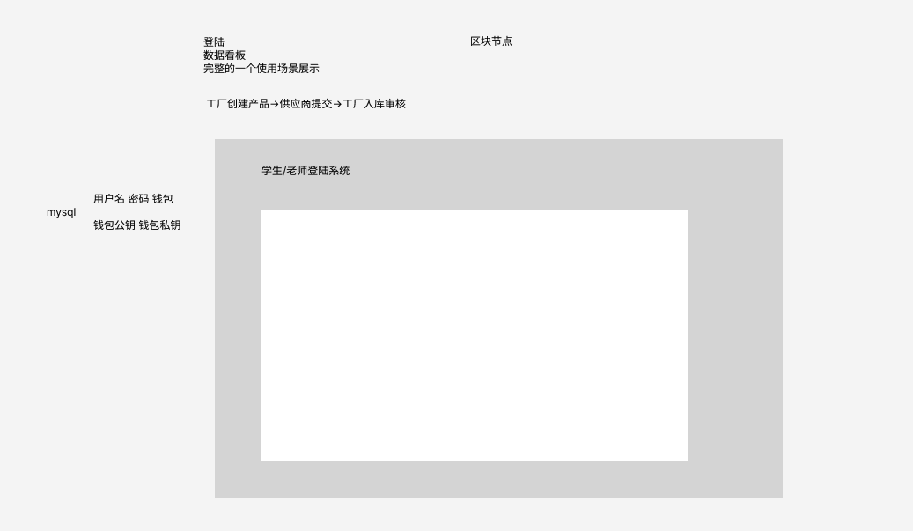

# IndustryPreDemo

# 需求分析

## 角色分类

- 供应商

- 工厂端

- 用户端

## 供应商

需求：配件交付，将产品型号、序列号、产品详细信息（名称、型号、备注）上链 -> 得到入库hash编码

## 工厂端

需求1： 创建配件信息库： 提供产品型号和产品详细信息 -> 在配件列表中维护

需求2： 配件入库：提供供应商端得到的入库hash编码，实现配件入库

需求3： 配件出库：提供配件信息，将配件出库

需求4： 查询某个型号配件的所有在库产品

需求5： 维护配件列表何产品型号展示

## 用户端

需求：提供序列号 -> 查询产品详细信息 和 产品流动轨迹

## 数据结构

# 前后端对接

## 供应商页面

产品1

0x1234567890abcdef

## 会议沟通问题：

用户登陆身份，权限管理 -> 中心化的登陆

个人中心，信息编辑

输入框旁的问号：描述，范例

输入框的报错，校验

供应商 : 型号匹配显示详细信息

整体描述 -> 多入口  示意图 

